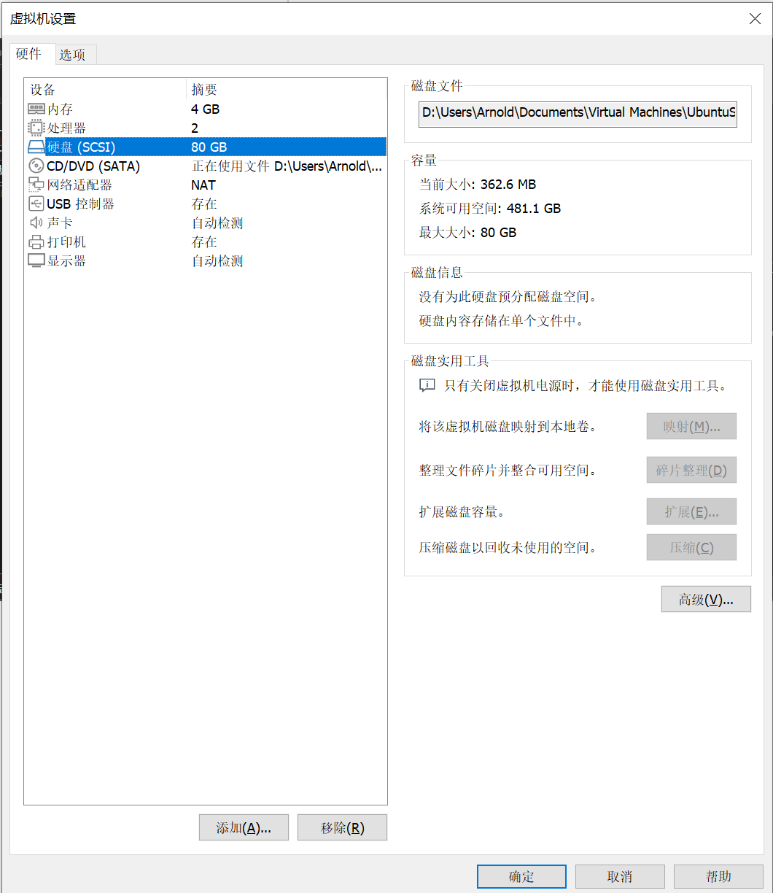

本文介绍了一种纯命令行形式的Ubuntu Server扩展磁盘空间的方法，在虚拟机里的Ubuntu Server 20.04下进行了验证。

<!-- more -->

这个学期新开了大数据的课，久违的使用VMware安装了虚拟机。但好像错误地估计了磁盘所需要使用的空间，故需要扩展一下虚拟机磁盘。

## 1. 虚拟机磁盘扩充
我使用的是VMware16Pro，选择需要扩展的虚拟机，打开设置

找到硬盘，选择扩展即可。因为我的机器是开着的，所以扩展的选项是灰色的。  
为了运行云计算和大数据相关程序，**建议将硬盘留有50GB以上空间**，我这里还要安装其他应用，所以扩展成80GB。

## 2. 用fdisk创建新分区
指创建物理上的分区(Partition)  
需要管理员权限，因为我是root操作，所以所有的提权命令都省略了。如果权限不够就`sudo`一下  
``` 
fdisk /dev/sda
```

进入fdisk后，**command输入n**，代表要新建分区  
**按下4，回车**，再跳过**两个默认的选项**，最后**键入w回车保存**。这样，新的分区4就创建好了。
```
Command (m for help): n
Partition number (4-128, default 4): 4
First sector (20969472-41943006, default 20969472):
Last sector, +/-sectors or +/-size{K,M,G,T,P} (20969472-41943006, default 41943006):

Created a new partition 4 of type 'Linux filesystem' and of size 60 GiB.

Command (m for help): w
The partition table has been altered.
Syncing disks.
```

## 3. 用pvcreat创建物理卷
意为，在分区上标记：这个分区是空闲的
```
pvcreate /dev/sda4
```
运行结束后，可以用`pvscan`查看一下物理卷的情况：
```
PV /dev/sda3   VG ubuntu-vg       lvm2 [<19.00 GiB / 0    free]
PV /dev/sda4                      lvm2 [60.00 GiB]
Total: 2 [<79.00 GiB] / in use: 1 [<19.00 GiB] / in no VG: 1 [60.00 GiB]
```
可以看到，/dev/sda3 在卷组**ubuntu-vg**里，而 /dev/sda4 不在。

## 4. 用vgextend把新物理卷添加到卷组
先前有描述错误，由[Wing0v0](https://github.com/Wing0v0)和[scchen9966](https://github.com/scchen9966)指出。先前的描述为：
```
vgextend ubuntu=-vf /dev/sda4
```
应当是：
```
vgextend ubuntu-vg /dev/sda4
```

## 5. 用lvextend给逻辑卷扩容
查看一下磁盘叫啥
```
df -h
```
找到`Mounted on`是`\`的磁盘，比如，我这是：
```
/dev/mapper/ubuntu—vg-ubuntu—lv
```
就运行命令扩容：
```
lvextend -l +100%FREE /dev/mapper/ubuntu--vg-ubuntu--lv
```

## 6. 用resize2fs让逻辑卷的扩容生效
如果不执行该命令，扩容不会生效！
```
resize2fs /dev/mapper/ubuntu--vg-ubuntu--lv
```
好了，磁盘就扩展好了！用`df -h`看看：
```
Filesystem                         Size  ...
...
/dev/mapper/ubuntu--vg-ubuntu--lv   79G  ...
...
```
OK，扩容完成！尽管造吧！啊哈哈哈哈哈！

此文就到此结束啦！欢迎大家在评论区留言哦ヾ(^▽^*)))  
Ciallo～(∠・ω< )⌒☆​  
写文不易，如果你觉得我的文章对你有帮助，欢迎[打赏](https://arnold117.github.io/likes/)！